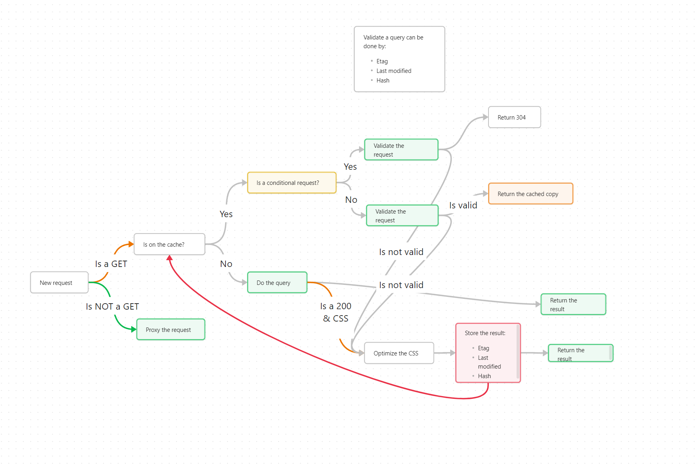

# YOPZ

Example of a transparent CSS/JS/Image optimizer proxy.

---



---

Example of a Traefik Go middleware that does something similar as a reference:

```go
package cssoptimizer

import (
	"bytes"
	"context"
	"io"
	"net/http"
	"regexp"
	"sync"
	"time"
)

// CacheEntry stores the optimized CSS and associated metadata.
type CacheEntry struct {
	OptimizedCSS  string
	ETag          string
	LastModified  string
}

// Config is the plugin configuration structure.
type Config struct{}

// CreateConfig creates the plugin configuration.
func CreateConfig() *Config {
	return &Config{}
}

// CSSOptimizer is a middleware structure with caching and validation capabilities.
type CSSOptimizer struct {
	next  http.Handler
	cache map[string]*CacheEntry
	mu    sync.Mutex // To ensure thread-safe access to the cache
}

// New creates a new instance of the middleware.
func New(ctx context.Context, next http.Handler, config *Config, name string) (http.Handler, error) {
	return &CSSOptimizer{
		next:  next,
		cache: make(map[string]*CacheEntry),
	}, nil
}

// ServeHTTP processes the HTTP request, performs conditional requests, and caches the response.
func (c *CSSOptimizer) ServeHTTP(rw http.ResponseWriter, req *http.Request) {
	filePath := req.URL.Path // Use the request path as a cache key

	c.mu.Lock()
	cacheEntry, exists := c.cache[filePath]
	c.mu.Unlock()

	// If cached, make a conditional request to validate the cache
	if exists {
		conditionalReq := req.Clone(req.Context())
		if cacheEntry.ETag != "" {
			conditionalReq.Header.Set("If-None-Match", cacheEntry.ETag)
		}
		if cacheEntry.LastModified != "" {
			conditionalReq.Header.Set("If-Modified-Since", cacheEntry.LastModified)
		}

		// Send the conditional request
		client := &http.Client{}
		resp, err := client.Do(conditionalReq)
		if err == nil && resp.StatusCode == http.StatusNotModified {
			// Serve from cache if the file is unchanged
			rw.Header().Set("Content-Type", "text/css")
			rw.WriteHeader(http.StatusOK)
			rw.Write([]byte(cacheEntry.OptimizedCSS))
			return
		}
	}

	// Capture the response for processing
	rec := &responseRecorder{
		ResponseWriter: rw,
		body:           bytes.NewBuffer(nil),
	}
	c.next.ServeHTTP(rec, req)

	// Check if the response is CSS
	contentType := rec.Header().Get("Content-Type")
	if contentType == "text/css" {
		// Optimize CSS
		optimizedCSS := optimizeCSS(rec.body.String())

		// Cache the optimized CSS
		c.mu.Lock()
		c.cache[filePath] = &CacheEntry{
			OptimizedCSS: optimizedCSS,
			ETag:         rec.Header().Get("ETag"),
			LastModified: rec.Header().Get("Last-Modified"),
		}
		c.mu.Unlock()

		// Serve the optimized CSS
		rw.Header().Set("Content-Type", contentType)
		rw.WriteHeader(rec.statusCode)
		rw.Write([]byte(optimizedCSS))
	} else {
		// Serve non-CSS content directly
		rw.WriteHeader(rec.statusCode)
		rw.Write(rec.body.Bytes())
	}
}

// optimizeCSS removes comments and extra whitespaces from the CSS.
func optimizeCSS(css string) string {
	// Simulate a slow process with sleep (remove in production)
	time.Sleep(2 * time.Second)

	// Remove comments
	reComments := regexp.MustCompile(`\/\*[\s\S]*?\*\/`)
	css = reComments.ReplaceAllString(css, "")

	// Remove extra whitespaces
	reWhitespace := regexp.MustCompile(`\s+`)
	css = reWhitespace.ReplaceAllString(css, " ")

	return css
}

// responseRecorder is a helper to capture the response body.
type responseRecorder struct {
	http.ResponseWriter
	statusCode int
	body       *bytes.Buffer
}

func (r *responseRecorder) WriteHeader(statusCode int) {
	r.statusCode = statusCode
}

func (r *responseRecorder) Write(data []byte) (int, error) {
	r.body.Write(data)
	return r.ResponseWriter.Write(data)
}
```
